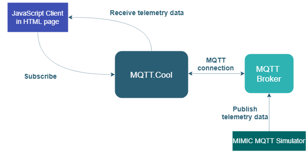

# MQTT.Cool - MQTT Throttling Demo - HTML Client

The **MQTT Throttling Demo** is a demonstration of MQTT.Cool data throttling 
using simulated sensors by [MIMIC MQTT Simulator](https://www.gambitcomm.com/site/mqttsimulator.php).

## Live Demo

[](https://demos.mqtt.cool/mqtt-throttling)

### [ View live demo](https://demos.mqtt.cool/mqtt-throttling)


## Details

The **MQTT Throttling Demo** uses the MQTT.Cool Web Client API to show how 
MQTT.Cool can be used to send real-time telemetry data through the Web and,
very important, how incoming update flow can be further manipulated in terms of
bandwidth and frequency.

The demo leverages the flexibility and power offered by [MIMIC MQTT Simulator](https://www.gambitcomm.com/site/mqttsimulator.php),
by which it is extremely easy to generate an unlimited range of simulated
scenarios.

In this case, we simulate a set of sensors that:
- Continuously detect the distance between themselves and fictitious moving objects.
- Publish real-time data to a specific topic of the MQTT broker listening at `tcp://broker.mqtt.cool:1883`.<br/>

To keep things simple, distances vary as sine waves. Furthermore, waves are
generated with different frequencies to show different traffic patterns.

The web application submits an MQTT subscription for each sensor/topic to 
receive real-time data and displays them on the relative chart.

For each chart, a frequency selector can be handled to dynamically change the
maximum update rate of incoming messages of the related sensor. 

A max bandwidth selector allows you to change the bandwidth globally used by
subscriptions.

To make you appreciate the difference between throttled and not-throttled 
data, two kinds of connection are employed:

- A [shared connection](https://docs.mqtt.cool/server/guides/MQTT.Cool+Getting+Started+Guide.html#shared_connection),
whose MQTT subscriptions change the update rate according to the frequency 
slider. Messages are displayed as red points on the charts.
- A [dedicated connection](https://docs.mqtt.cool/server/guides/MQTT.Cool+Getting+Started+Guide.html#dedicated_connection),
whose MQTT subscriptions receive data as they come, which means that any change
on the sliders does not affect how data flow from the MQTT broker to the web
page. Messages are displayed as continuos orange lines.

You can see how the bandwidth and frequency constraints act on different levels.
The bandwidth constraint globally applied the shared connection. On the other
hand, the frequency constraint is applied to each MQTT subscription individually.
Both the constraints set an upper bound, which is dynamically managed by MQTT.Cool.
Note that the updates are not queued and delayed, but resampled and conflated.
In other words, when a subscription has a chance to be updated (based on a
round-robin algorithm), it will receive the very latest available message,
not an old one.

### Overall Architecture

Here the overall architecture of the demo:



## Install

If you want to install a version of this demo pointing to your local MQTT.Cool,
follows these steps.

* Download MQTT.Cool from the mqtt.cool web site
[download page](https://mqtt.cool/download/latest-server) and unpack it (see
the [Quick Start](https://docs.mqtt.cool/server/guides/MQTT.Cool+Getting+Started+Guide.html#_quick_start) section of *Getting Started Guide* for more details).
* Launch the MQTT.Cool server.
* Download this project.
* As the latest version of the MQTT.Cool JavaScript library is always available
through [`unpkg`](https://unpkg.com/#/), it is hot-linked in the html page.
* Deploy this demo on MQTT.Cool (used as Web server) or in any external Web
server. If you choose the former, create a folder with name such as
`mqtt-throttling` under the `<MQTT.COOL_HOME>/pages` folder, and copy there the
contents of `src/web` of this project.

## Configure

The demo assumes that the MQTT.Cool server is launched from localhost, but if
you need to target a different server, search in `src/web/js/app.js` this
line:

```js
const MQTT_COOL_URL = 'http://localhost:8080';
```

and change it accordingly.

## Launch

Open your browser and point it to
[http://localhost:8080/mqtt-throttling](http://localhost:8080/mqtt-throttling),
or to the address according to the host and/or the name of the folder where you
deployed the project.

Immediately, the gauges in the web page reflect updates according to the
received real-time metrics.

## See Also

* [Check out all other demos on MQTT.Cool site](https://mqtt.cool/demos)

## MQTT.Cool Compatibility Notes

* Compatible with MQTT.Cool SDK for Web Clients version 1.2.1 or newer.
* Compatible with MQTT.Cool since version 1.2.0 or newer.
